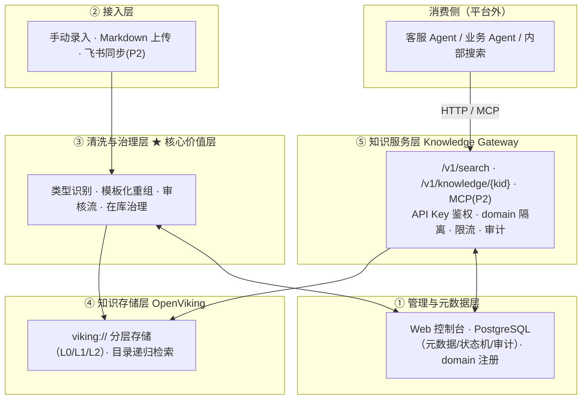

# 总体架构

> **溯源**：设计文档 一、二章；技术设计文档 二章
> **代码入口**：`app/`
> **关联 ADR**：ADR-0001 ～ ADR-0006
> **最后同步**：2026-07-04

## 平台定位

**面向 Agent 的公司级知识中台**：知识的生产、清洗、治理集中在平台完成；客服 Agent、业务 Agent 等只作为消费方，通过标准接口（HTTP / MCP）获取知识。一句话分工：**平台决定知识"长什么样、谁能用、活多久"；Agent 只管"检索与引用"**（设计 1.2）。

解决的四个痛点（设计 1.1）：知识不可直接用（口语长文切片不自包含）、重复建设（各 Agent 自维护副本口径不一）、质量不可控（无 owner / 生效期 / 冲突检测）、不可追溯（答错定位不到引用来源）。

## 五层架构

原图为设计 2.1 画板，此处用 Mermaid 重表达：

| 层 | 职责 | 模块文档 |
|-|-|-|
| ⑤ 知识服务层 | 检索 / 取全文 API、domain 权限隔离、审计 | [gateway.md](modules/gateway.md)、[audit.md](modules/audit.md) |
| ④ 知识存储层 | viking:// 存储与检索（平台经客户端封装访问） | [storage.md](modules/storage.md) |
| ③ 清洗与治理层 | 解析、模板校验、敏感检测、去重、发布 | [pipeline.md](modules/pipeline.md)、[domain.md](modules/domain.md) |
| ② 接入层 | 表单录入、Markdown 上传（P1）；飞书同步（P2） | [console.md](modules/console.md)、[pipeline.md](modules/pipeline.md) |
| ① 管理与元数据层 | 控制台、PostgreSQL 单一事实来源 | [console.md](modules/console.md)、[storage.md](modules/storage.md) |

## 关键架构决策

六个关键决策（设计 2.2），全部已录入 ADR：

| 决策 | ADR |
|-|-|
| Gateway 完全封装 OpenViking，Agent 不直连 | [ADR-0001](decisions/0001-gateway-unified-entry.md) |
| 元数据与状态放 PostgreSQL，OpenViking 只存 published 正文 | [ADR-0002](decisions/0002-pg-single-source-of-truth.md) |
| domain 白名单映射 viking:// 一级目录 | [ADR-0003](decisions/0003-domain-directory-isolation.md) |
| 知识按条存储：一条知识 = 一个文件 | [ADR-0004](decisions/0004-one-knowledge-one-file.md) |
| 规范化在入库前完成，不依赖存储层 | [ADR-0005](decisions/0005-normalize-before-ingest.md) |
| LLM 规则优先、分级触发，Phase 1 零 LLM | [ADR-0006](decisions/0006-rules-first-llm-fallback.md) |

## 进程与代码结构

MVP 为单体应用 + 独立调度进程（技术 二）。Gateway（`/v1/*`）与控制台 API（`/api/*`）**同进程、按路由划分**，共享领域层与存储层代码，避免逻辑漂移。

| 进程 | 职责 | 实例数 |
|-|-|-|
| api | FastAPI（uvicorn）：Gateway + 控制台 + 审计异步写入 | ≥2，无状态 |
| scheduler | APScheduler：写入重试、审计分区维护；P3 加过期扫描与报表 | 1（单点，任务幂等） |

模块 ↔ 文档 ↔ 飞书章节映射：

| 代码模块 | 模块文档 | 技术设计文档 | 设计文档 |
|-|-|-|-|
| `app/gateway/` | [gateway.md](modules/gateway.md) | 六、十 | 六 |
| `app/console/` | [console.md](modules/console.md) | 七 | 七 |
| `app/pipeline/` | [pipeline.md](modules/pipeline.md) | 八、附录 A/B | 三、四 |
| `app/domain/` | [domain.md](modules/domain.md) | 四、五 | 4.2 |
| `app/storage/` | [storage.md](modules/storage.md) | 三、九、十 | 五 |
| `app/scheduler/` | [scheduler.md](modules/scheduler.md) | 二、八、十一 | — |
| `app/audit/` | [audit.md](modules/audit.md) | 十一 | 6.3 |

## 外部依赖

四项：PostgreSQL 15+、Redis 6+、OpenViking（独立 HTTP 服务）、公司模型网关。

⚠️ 模型网关是 **P1 就存在的依赖**——OpenViking 每次写入后自动生成 L0/L1 摘要、无法跳过（设计 4.5 已查证 SDK）；"零 LLM"仅指平台流水线侧。上线前必须为 OpenViking 配好模型网关接入。

## 一条知识的生命周期

以设计 2.3 的发票答疑长文为例：口语原文经清洗层**拆**（按问题边界切条）、**洗**（清除口语与悬空指代，答案自包含）、**归位**（隐含条件升为显式字段）、**补**（相似问法与元数据补齐）后成为模板化知识，走校验 → 发布 → OpenViking 入库 → Agent 检索引用，全程状态由 [domain.md](modules/domain.md) 的状态机管理，每次检索留审计。
