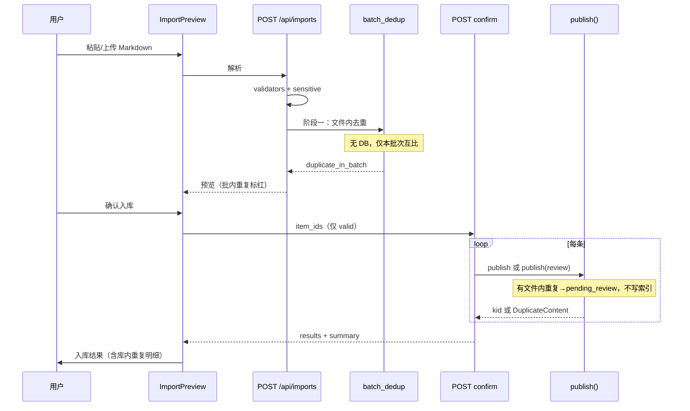

# 导入两阶段内容去重（import dedup two-stage）

> 日期：2026-07-05  
> 状态：**已评审**（2026-07-05，见附录 B）  
> 溯源：设计文档 4.3.3（三级漏斗第一级 content_hash 去重）；技术设计文档 8.4；`backend/doc/modules/pipeline.md`、`console.md`；拆分预览确认页（设计 7.2-⑦）  
> 关联 ADR：ADR-0002（PG 为事实源）、ADR-0007（校验规则与模板冻结）  
> 触发背景：P1 批量导入实测——100 条 FAQ 含大量重复，预览阶段无批内重复提示；库内重复仅在 confirm 才暴露且体验差

---

## 1. 核心模型：两阶段去重

去重拆为 **两个独立阶段**，职责不同、用户预期不同：

```
┌──────────────────────────────────────────────────────────────────┐
│  阶段一 · 预览（当前文件内容）                                      │
│  时机：POST /api/imports、POST /api/source-docs/{id}/update       │
│  范围：本批次 Markdown 拆条结果内部                                 │
│  目的：帮用户清理「这份文件里自己重复粘贴」的问题，入库前可改         │
│  实现：纯内存，无 DB 查询                                           │
├──────────────────────────────────────────────────────────────────┤
│  阶段二 · 提交（库内去重）                                          │
│  时机：POST /api/imports/{id}/confirm（逐条 publish）              │
│  范围：全库非 archived 知识（content_hash 全局唯一）                 │
│  目的：防止与平台已有知识重复入库（设计 4.3.3 第一级漏斗）            │
│  实现：publish() 内 _find_duplicate + uq_knowledge_hash 兜底       │
└──────────────────────────────────────────────────────────────────┘
```

**设计意图**：

| 阶段 | 回答的问题 |
|------|------------|
| 预览 | 「这份文件里有没有重复条目？」——文件自检，用户还能回去改 Markdown |
| 提交 | 「这些内容会不会和库里已有知识撞车？」——平台级约束，只有真正入库时才查 |

预览 **不查库**；库内去重 **只在 confirm**，与单条表单 `submit → publish()` 语义一致。

---

## 2. 背景与问题

### 2.1 现状

| 阶段 | 接口 | 当前校验 |
|------|------|----------|
| 解析预览 | `POST /api/imports`、`POST /api/source-docs/{id}/update` | 模板 + 敏感；同名文件预查；**无批内 content_hash 去重** |
| 确认入库 | `POST /api/imports/{id}/confirm` | 逐条 `publish()` → **库内 content_hash 去重**（results.error） |

### 2.2 用户痛点

1. **预览阶段**：100 条里大量内容相同，仍全部「校验通过」——用户无法在改文件阶段发现问题；**缺少「只看重复项」筛选**，核对成本高。
2. **提交阶段**：库内重复只在 confirm 逐条报错，大批量时体验差（超时、重复点击）；错误展示依赖 confirm 返回，预览页无预期。
3. **批内重复顺序不确定**：confirm 串行，先成功的不一定是 seq 最小的。

### 2.3 本方案边界

- **预览补批内去重**（阶段一，本方案重点实现）。
- **预览重复项筛选**（§7.4，P1 必做）：有重复时一键查看 copy / 保留项。
- **库内去重保持 confirm**（阶段二，增强结果展示与幂等，不挪到预览）。
- P1 不引入 MQ / 异步入库。

---

## 3. 阶段一：预览 — 当前文件内容去重

### 3.1 范围定义

「当前文件内容」= **本批次 `import_item` 列表**（本次粘贴/上传/更新重拆的全部条目）。

- **首次导入**：拆条后的 N 条 item 互相比对。
- **更新导入**：重拆后的 N 条 item 互相比对（含 `new` / `changed`；不含 `disappeared` 空正文）。
- **不**与库内已有条目比对（即使更新模式、即使同文件下已有 kid）。
- **不**与 `align_action=unchanged` 的「旧版本」比对——unchanged 本身不入库，跳过。

### 3.2 判定规则

哈希：与发布链路一致，`content_hash(type_, fields)`。

| 条件 | 处理 |
|------|------|
| `align_action ∈ {unchanged, disappeared}` | 跳过批内去重 |
| 模板/敏感 blocking | 跳过批内去重（已 invalid） |
| 同批次 **seq 更小** 的条目已有相同 hash | **blocking**：`duplicate_in_batch` |
| 其余 | 无 finding |

**先到先得（按 seq 升序）**：seq=3 与 seq=50 内容相同 → seq=3 可 valid，seq=50 blocking。用户可在预览页明确看到「保留第 3 条、去掉第 50 条」。

> 更新模式下两条 `new` 内容相同 → 批内重复。  
> 一条 `changed` 改完后与同批某 `new` hash 相同 → 批内重复。  
> 新内容与库内旧条目相同但标题不同（disappeared+new）→ **预览不报**，留阶段二处理。

### 3.3 validation 格式

```json
{
  "rule": "duplicate_in_batch",
  "level": "blocking",
  "message": "与本文件第 3 条内容重复",
  "meta": {
    "scope": "batch",
    "duplicate_seq": 3,
    "duplicate_item_id": 101,
    "content_hash": "a1b2…"
  }
}
```

`is_valid` = 模板 + 敏感 + **批内去重** 均无 blocking。

### 3.4 调用点（仅阶段一）

| 调用点 | 行为 |
|--------|------|
| `upload_import` | 拆条循环：validators → sensitive → **batch_dedup** → 写 validation / is_valid |
| `source_docs.update` | 对齐生成 items 后同上 |
| `preview_import`（GET） | 读已存 validation 返回；批内结论 **不变**（纯文本快照，无需重算） |
| `_batch_out` | 可选 `stats.duplicate_in_batch` |

**不调用** `global_dedup_findings`；GET 不重跑库内查询。

---

## 4. 阶段二：提交 — 库内去重

### 4.1 范围与时机

- **唯一入口**：`POST /api/imports/{id}/confirm` → 每条勾选 item 调用 `publish()`。
- **范围**：全库 `knowledge.content_hash`，`status <> 'archived'`（与现网一致，跨 domain / 跨文件）。
- **exclude_kid**：`align_action=changed` 时传 `match_kid`，更新自身合法。

### 4.2 现网行为（保留）

```python
existing_kid = await _find_duplicate(session, hash_, exclude_kid=kid)
if existing_kid:
    raise DuplicateContent(existing_kid)
```

confirm 捕获后写入 results：

```json
{ "item_id": 50, "kid": null, "error": "与 FAQ-FO-000042 内容重复" }
```

`!is_valid` 条目（含批内重复）confirm 直接返回 `"blocking 校验未通过"`，不调 publish。

### 4.3 本方案对阶段二的增强

| 增强项 | 说明 |
|--------|------|
| E1 结果汇总 | confirm 响应增加 `summary`：`{ succeeded, failed_blocking, failed_duplicate, failed_other, pending_review }` |
| E2 前端入库步 | 步骤 2「入库」按 results 分类展示：成功 kid / 库内重复 / 其他失败；库内重复 kid 可跳转 |
| E3 幂等 | `item.result_kid` 已有 → 跳过 publish，返回成功（防超时重试误报重复） |
| E4 提示文案 | 预览页底部说明：「文件内重复在此拦截；与平台已有知识重复在确认入库后校验」 |
| E5 **待审核入库** | 见 §4.5（**Q2 已决**） |

**不在预览做库内预检**——避免预览与提交 double-check 职责混乱；库内冲突以 confirm 为准（含 preview→confirm 窗口内他人新入库的 race，publish + 唯一索引兜底）。

### 4.5 含文件内重复时的入库状态（Q2 已决）

预览阶段若检出 **任意** `duplicate_in_batch`（`stats.duplicate_in_batch > 0`），本批次 confirm 成功写入的条目 **不得走绿色通道直接发布**，改为：

| 项 | 无文件内重复（现网） | 有文件内重复（Q2） |
|----|----------------------|---------------------|
| 状态迁移 | `SUBMIT_PASS` → **published** | `SUBMIT_RISK` → **pending_review** |
| OpenViking | 调用 `viking.write`，`index_state=indexing` | **不调用** `viking.write`，`index_state=none` |
| 检索可见 | 索引就绪后可 search | **不可 search**，待 P2 审核通过后发布 |
| import_batch.status | `confirmed` | `confirmed`（批次处理完毕，语义不变） |

**判定时机**：confirm 开始时扫描批次内是否 **曾存在** 批内重复项（读 `import_item.validation` 含 `duplicate_in_batch`，或 `_batch_out.stats.duplicate_in_batch > 0`）。与用户最终勾选哪些条目无关——只要文件里出现过重复 copy，本批成功入库的 canonical 条一律 **待审核**。

**无文件内重复的批次**：行为与现网完全一致（`published` + 写索引）。

**实现要点**：

1. **状态机补一行**（代码已有 `DRAFT→pending_review`，缺新建路径）：
   ```python
   (None, Event.SUBMIT_RISK): Status.PENDING_REVIEW,
   ```
2. **`publish()` 增加参数** `mode: Literal["publish", "review"] = "publish"`：
   - `publish`：`SUBMIT_PASS` + viking.write（现网）
   - `review`：`SUBMIT_RISK` + 跳过 viking.write + `index_state="none"`
3. **`confirm_import`**：`requires_review = stats.duplicate_in_batch > 0`，循环内 `publish(..., mode="review" if requires_review else "publish")`。
4. **响应**：每条成功 result 增加 `status: "pending_review" | "published"`；summary 增加 `pending_review` 计数。
5. **P2 衔接**：审核通过走既有 `REVIEW_APPROVE → published` + viking.write（review_task 表 P2 交付；P1 仅落库待审态，控制台列表可按 `pending_review` 筛选查看）。

**库内重复**（阶段二去重失败）：仍为 results.error，**不**创建 pending_review 条目。

### 4.4 库内重复的 validation 格式（仅 confirm 结果，不进预览 validation）

前端用 confirm `results[]` 展示，结构已够用；若需统一组件，可映射为：

```json
{
  "rule": "duplicate_content",
  "level": "error",
  "message": "与已有知识 FAQ-FO-000042 内容重复",
  "meta": { "scope": "global", "existing_kid": "FAQ-FO-000042" }
}
```

---

## 5. 架构与模块

### 5.1 新增 `app/pipeline/dedup.py`

```python
@dataclass
class DedupInput:
    seq: int
    item_id: int | None
    fields: dict[str, str]
    align_action: str = "new"

@dataclass
class DedupFinding:
    rule: str           # duplicate_in_batch（阶段一仅此一种）
    level: Literal["blocking"]
    message: str
    meta: dict

def batch_dedup_findings(
    type_: str,
    items: list[DedupInput],
) -> dict[int, list[DedupFinding]]:
    """阶段一：当前文件/批次内去重，O(n)，无 DB。"""
    ...

def merge_dedup_into_validation(
    validation: list[dict],
    findings: list[DedupFinding],
) -> tuple[list[dict], bool]:
    """合并 findings，返回 (新 validation, 是否仍 valid)。"""
    ...
```

库内去重 **不新增函数**，继续复用 `publish._find_duplicate`。

### 5.2 数据模型

不改表。阶段一结论存 `import_item.validation`；阶段二结论存 confirm 响应 `results` + 可选 `item.result_kid`。

---

## 6. API 契约

### 6.1 预览响应（阶段一）

```json
{
  "id": 12,
  "items": [
    {
      "id": 101,
      "seq": 3,
      "is_valid": true,
      "validation": []
    },
    {
      "id": 102,
      "seq": 50,
      "is_valid": false,
      "validation": [
        {
          "rule": "duplicate_in_batch",
          "level": "blocking",
          "message": "与本文件第 3 条内容重复",
          "meta": { "scope": "batch", "duplicate_seq": 3, "duplicate_item_id": 101 }
        }
      ]
    }
  ],
  "stats": {
    "total": 100,
    "valid": 75,
    "duplicate_in_batch": 25,
    "requires_review": true
  }
}
```

`requires_review` = `duplicate_in_batch > 0`，驱动前端文案与 confirm 入库模式。

### 6.2 确认响应（阶段二，扩展）

```json
{
  "id": 12,
  "status": "confirmed",
  "source_doc_id": 5,
  "requires_review": true,
  "summary": {
    "succeeded": 70,
    "pending_review": 70,
    "failed_duplicate": 5,
    "failed_blocking": 0,
    "failed_other": 0
  },
  "results": [
    { "item_id": 103, "kid": "FAQ-FO-000100", "status": "pending_review", "error": null },
    { "item_id": 104, "kid": null, "error": "与 FAQ-FO-000042 内容重复" }
  ]
}
```

`requires_review=false` 时，成功 result 的 `status` 为 `published`，summary 中 `pending_review=0`。

---

## 7. 前端交互

### 7.1 预览步（阶段一）

- 批内重复：红色 **blocking**，文案统一用 **「本文件」**（Q1 已决），如「与本文件第 N 条内容重复」；点击 N 跳转并高亮（§7.4.4）。
- 顶栏：`拆出 100 条 · 可入库 75 条 · 文件内重复 25 条`；**重复数 > 0 时「文件内重复」可点击，一键切到重复筛选**（§7.4）。
- **重复提示（Q6 已决）**：`duplicate_in_batch > 0` 时展示 **`Alert type="warning"`**（不自动切筛选）：
  > 检测到 **25** 条文件内重复，请核对并修正源文件。确认入库后，本批成功条目将进入 **待审核**，暂不写入检索索引。  
  > [查看重复项] → `setFilter('duplicate')`
- 底部说明：文件内重复在此处理；与平台已有知识是否重复，确认入库后校验。
- `defaultSelected`：仍过滤 `is_valid`（现有逻辑）。
- **存在重复项时，必须提供重复筛选**（§7.4，P1 必做）。

### 7.2 入库步（阶段二）

- 展示 `summary`：成功 / **待审核** / 库内重复 / 其他失败计数。
- 每条 result：成功 → kid 链接 + 状态 Tag（`待审核` / `已发布`）；库内重复 → 错误文案 + 冲突 kid 链接。
- `requires_review=true` 时总结文案：「N 条已进入待审核，暂未写入检索索引，审核通过后可检索。」
- **确认入库按钮文案**：`requires_review` 时改为「确认提交审核」；否则维持「确认入库」。副文案：有重复时写「待审核，不写检索索引」；无重复时写「低风险自动发布（绿色通道）」。
- 部分成功时：区分库内重复失败与待审核成功。
- 入库结果列表 **同样分页**（与预览步共用分页组件逻辑）。

### 7.3 预览列表分页（条目过多时）

#### 7.3.1 背景

当前 `ImportPreview` 对 `batch.items` 全量 `map` 渲染（见 `frontend/src/pages/ImportPreview.tsx`）。条目数少时尚可；**100+ 条**时 DOM 过多、滚动过长，勾选/核对成本高。分页为 **纯前端能力**，批次数据已在首次解析时一次返回，P1 **不改后端接口**。

#### 7.3.2 方案：客户端分页

| 项 | 约定 |
|----|------|
| 触发 | `batch.items.length > pageSize` 时展示分页器；否则隐藏（≤20 条体验与现网一致） |
| 默认 `pageSize` | **20**（Q4 已决） |
| 可选 `pageSize` | 10 / 20 / 50 |
| 分页器位置 | 条目列表 **下方**（antd `Pagination`，`showSizeChanger` + `showTotal`） |
| 切换页 | 仅渲染当前页条目 Card；**不**卸载 `selected` / `expanded` 状态（跨页保留） |

#### 7.3.3 与勾选 / 全选的关系

分页 **不改变** 勾选语义——操作对象始终是 **全批次**，不是「当前页」：

| 操作 | 行为 |
|------|------|
| 全选 Checkbox | 勾选全部 **可勾选** 条目（`selectableIds`，跨全批次） |
| 当前页单条勾选 | 只改该条，其他页已选状态保留 |
| 顶栏「已选 M/N」 | M/N 为 **全批次** 统计，不含页码 |
| 确认入库 | 仍提交完整 `selected: number[]`，与是否分页 / 筛选视图无关 |

#### 7.3.4 筛选与分页联动

列表筛选见 **§7.4**（重复项筛选为 P1 必做）。分页针对 **当前筛选结果** 切片；切换筛选项时 `setPage(1)`。

#### 7.3.5 搜索（P1.1）

标题关键词过滤（匹配 `item.title`）；FAQ 可搜标准问法。P1 不做，放 P1.1。

#### 7.3.6 跨页定位（批内重复联动）

点击「与本文件第 N 条重复」时：

1. 根据 `duplicate_item_id` 或 `duplicate_seq` 找到目标条目在全列表中的下标；
2. 计算目标页码 `page = floor(index / pageSize) + 1`，`setPage(page)`；
3. 可选：`scrollIntoView` 高亮目标 Card 2s（`outline` 或背景色）。

入库步 result 列表若条目多，同样支持按页浏览。

#### 7.3.7 展开详情与性能

- 条目展开（`expanded`）状态跨页保留；切页后未渲染的 Card 不挂载 DOM。
- 展开区字段预览仍截断 120 字（现网）；全文以 seq / 标题辨识，详情入库后进知识详情页查看。
- **不做** 虚拟滚动（P1）；分页已足够。若单批 >500 条再评估虚拟列表。

#### 7.3.8 组件结构（实现参考）

```tsx
// 状态（filter 见 §7.4）
const [page, setPage] = useState(1)
const [pageSize, setPageSize] = useState(20)
const [filter, setFilter] = useState<PreviewFilter>('all')

const filteredItems = useMemo(() => applyPreviewFilter(batch.items, filter, selected), [...])
const pageItems = useMemo(() => slicePage(filteredItems, page, pageSize), [...])
```

切换批次（重新解析、`batchId` 变化）时 `setPage(1)`、`setFilter('all')`。

#### 7.3.9 后端

**无变更**。`POST /api/imports` / `GET /api/imports/{id}` 仍返回完整 `items[]`。若未来单批超过 ~1000 条且响应体过大，再另案 `GET /api/imports/{id}/items?page=&page_size=`（非 P1）。

### 7.4 预览重复项筛选（P1 必做）

#### 7.4.1 目标

批次存在文件内重复时，用户需 **快速只看重复条目**，核对后回源文件删除多余 copy，无需在 100 条里逐页翻找。筛选为 **纯前端**，依赖阶段一批内去重写入的 `validation`（`rule=duplicate_in_batch`）及 `stats.duplicate_in_batch`。

#### 7.4.2 筛选器 UI

位于条目列表上方（全选 Checkbox 与列表 Card 之间），使用 antd **`Segmented`** 或 **`Radio.Group`（button 样式）**：

| 值 | 标签 | 显示条件 | 过滤规则 |
|----|------|----------|----------|
| `all` | 全部 | 始终 | 不过滤 |
| `duplicate` | 重复项 | `stats.duplicate_in_batch > 0` | `validation` 含 `rule === 'duplicate_in_batch'` |
| `duplicate_keep` | 重复保留项 | 同上 | 见 §7.4.3 |
| `invalid` | 校验不通过 | `stats` 存在任意 `!is_valid` | `!item.is_valid` |
| `valid` | 可入库 | 始终 | `item.is_valid && align_action !== 'unchanged'` 且可勾选 |

**无重复时**：不展示 `duplicate` / `duplicate_keep` 两个 tab（或 disabled 并 tooltip「无文件内重复」），避免空筛选。

顶栏 Alert 中「文件内重复 **25** 条」数字为 **链接/按钮**：点击 → `setFilter('duplicate')` + `setPage(1)`。

#### 7.4.3 「重复保留项」定义

批内去重规则为 **seq 最小者保留**。除「重复项」（后出现的 copy）外，用户常需查看 **被保留的那一条**：

- 对每条 `duplicate_in_batch` 条目，从 `meta.duplicate_item_id` 或 `meta.duplicate_seq` 解析 **保留条 id**；
- `duplicate_keep` 筛选 = 所有重复项指向的保留条 **去重后的 id 集合**（一条保留项可能被多条重复引用，只出现一次）。

便于对照：「重复项」tab 看要删的 copy，「重复保留项」tab 看会入库的那条 canonical。

#### 7.4.4 与分页、勾选、跳转联动

| 场景 | 行为 |
|------|------|
| 切到「重复项」 | 列表仅重复 copy；分页总数变为重复条数；`setPage(1)` |
| 全选（筛选下） | 仅勾选 **当前筛选结果** 内 `selectableIds`（重复项均 invalid，通常不可勾选——全选作用于「可入库」筛选项更有意义） |
| 点击「与本文件第 N 条重复」 | 若当前为 `duplicate` 筛选，跳转到 **保留项**：临时 `setFilter('all')` 或 `duplicate_keep` + 定位 seq=N 的 Card 并高亮 2s |
| 重新解析 / 换 batch | `filter` 重置为 `all` |

#### 7.4.5 空状态

当前筛选无结果时（不应出现于 `duplicate` 若 stats 正确），展示 `Empty`：「当前筛选下无条目」。

#### 7.4.6 类型与工具函数

```typescript
type PreviewFilter = 'all' | 'duplicate' | 'duplicate_keep' | 'invalid' | 'valid'

function countDuplicateInBatch(items: ImportItemOut[]): number {
  return items.filter((i) =>
    i.validation.some((v) => v.rule === 'duplicate_in_batch'),
  ).length
}

function applyPreviewFilter(
  items: ImportItemOut[],
  filter: PreviewFilter,
  selected: number[],
): ImportItemOut[] {
  switch (filter) {
    case 'duplicate':
      return items.filter((i) =>
        i.validation.some((v) => v.rule === 'duplicate_in_batch'),
      )
    case 'duplicate_keep': {
      const keepIds = new Set<number>()
      for (const i of items) {
        const hit = i.validation.find((v) => v.rule === 'duplicate_in_batch')
        const id = hit?.meta?.duplicate_item_id
        if (id != null) keepIds.add(id)
      }
      return items.filter((i) => keepIds.has(i.id))
    }
    case 'invalid':
      return items.filter((i) => !i.is_valid)
    case 'valid':
      return items.filter(
        (i) => i.is_valid && i.align_action !== 'unchanged',
      )
    default:
      return items
  }
}
```

#### 7.4.7 后端配合

`stats.duplicate_in_batch` 在 `_batch_out` 中汇总（§6.1），供顶栏与筛选器是否展示重复 tab。无额外接口。

---

## 8. 测试口径

### 8.1 单元测试 `tests/test_dedup.py`（阶段一）

| 用例 | 预期 |
|------|------|
| 批内两条相同 FAQ | seq 小者 valid，大者 `duplicate_in_batch` |
| 三条相同 | 仅 seq 最小无 finding |
| unchanged / disappeared | 不参与批内比对 |
| 与库内相同内容 | **预览不报错**（is_valid 仍 true，若无其他 blocking） |

### 8.2 集成测试（两阶段）

| 用例 | 阶段 | 预期 |
|------|------|------|
| 上传含批内重复 md | 预览 | 重复项 is_valid=false |
| 上传与库内已有相同 | 预览 | is_valid=true；confirm 报 duplicate |
| confirm 仅 valid item_ids | 提交 | 批内重复项未传，不入库 |
| confirm 批次含文件内重复 | 提交 | 成功条 `pending_review`，`index_state=none`，无 viking.write |
| confirm 批次无文件内重复 | 提交 | 成功条 `published` + 写索引（现网） |
| changed exclude match_kid | 提交 | 更新自身不撞库 |
| result_kid 幂等重试 | 提交 | 第二次 confirm 已成功项不再报重复 |

### 8.3 前端

- 100 条批内重复 → 预览标红、不勾选。
- 含库内重复 → 预览仍绿；confirm 后入库步展示库内冲突。
- **分页**：100 条仅渲染当前页（默认 20 条/页）；全选勾选全批可选项；切页后勾选状态保留。
- **跨页定位**：点击批内重复链接跳到对应页并高亮目标条目。
- **重复提示（Q6）**：有重复时出现 warning Alert +「查看重复项」，**不**自动切筛选。
- **重复筛选（必做）**：「重复项」仅列 duplicate copy；顶栏重复数点击切入；「重复保留项」列 canonical 条。
- **待审核（Q2）**：含重复的批次 confirm 后，成功条展示「待审核」Tag。

---

## 9. 实施任务

| Task | 内容 | 阶段 |
|------|------|------|
| T1 | `pipeline/dedup.py` 仅 `batch_dedup_findings` + 单测 | 一 |
| T2 | `upload_import` / `source_docs.update` 接入批内去重 | 一 |
| T3 | `_batch_out` stats + ImportPreview 批内展示与说明文案 | 一 |
| T4 | confirm `summary` + `requires_review` + `publish(review)` + result_kid 幂等 + 入库步 UI | 二 |
| T5 | 状态机 `(None, SUBMIT_RISK)` + 集成测试 + 更新 pipeline.md / console.md | 一+二 |
| T6 | ImportPreview：**重复项筛选**（§7.4）+ 客户端分页 + 跨页定位；入库结果列表分页 | 前端 |

预估：**后端 0.5 天，前端 0.5–1 天**（含分页与去重 UI）。

---

## 10. 关联项（另案）

| 项 | 说明 |
|----|------|
| confirm 超时 | 100 条串行 publish > 15s；加长 timeout 或异步 job |
| 表单 validate 去重 | 单条 submit 已有库内 409；P1.1（Q5） |
| P2 审核通过写索引 | `REVIEW_APPROVE` 后 viking.write；review_task 表 P2 交付 |

---

## 11. 验收标准

1. **阶段一**：批内重复 blocking、文案用「本文件」、不勾选（Q1、Q3）。
2. **阶段一**：与库内已有知识相同的内容，预览 **不** blocking（仍可勾选）。
3. **阶段一（Q6）**：有重复时 warning Alert + 可点「查看重复项」，**不**自动切筛选。
4. **阶段二（Q2）**：批次曾含文件内重复时，confirm 成功条为 **pending_review**，**不写索引**。
5. **阶段二**：无文件内重复的批次，confirm 仍为 **published** + 写索引。
6. **阶段二**：库内重复返回明确 error + kid；summary 计数正确。
7. **分页（Q4）**：默认 20 条/页；全选/跨页勾选正确。
8. **重复筛选**：「重复项 / 重复保留项」筛选正确。

---

## 附录 A：两阶段流程



---

## 附录 B：评审结论（2026-07-05 已决）

| # | 问题 | **结论** |
|---|------|----------|
| Q1 | 批内重复 message 用「本文件」还是「本批次」 | **本文件** — 全文案统一「与本文件第 N 条内容重复」 |
| Q2 | 含文件内重复时，confirm 成功条目如何处理 | **pending_review（待审核）**，**不调用** `viking.write`，`index_state=none`，不可检索；`import_batch.status` 仍为 `confirmed`。无文件内重复的批次维持绿色通道 `published` + 写索引 |
| Q3 | 批内重复是否允许 warning 强制勾选 | **blocking**，重复 copy 不可勾选、不可入库 |
| Q4 | 分页默认每页条数 | **20** |
| Q5 | P1 是否做标题搜索 | **放 P1.1**，本方案不做 |
| Q6 | 有重复时是否默认切到「重复项」筛选 | **否**；但必须 **warning Alert 提示**有重复项，并提供「查看重复项」按钮切入筛选 |
